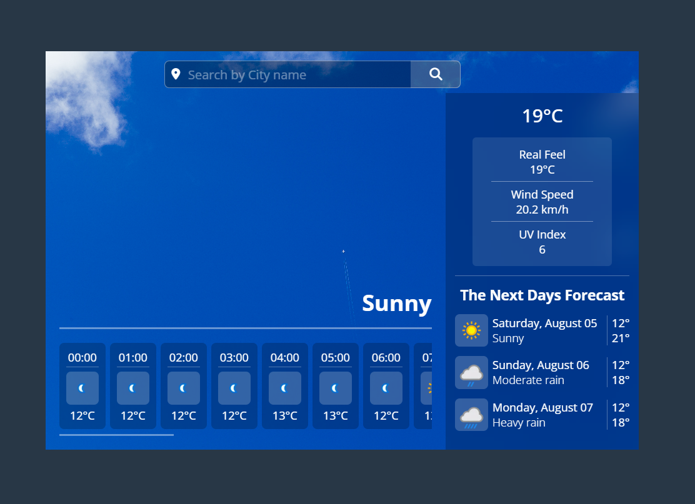

# Forecast


A weather forecast web application built with ReactJs.

Live link : [Forecast](https://suseelapetla.github.io/Forecast/)

## Features

- Current, Hourly and daily weather
- Dynamic Background
- Search Autocomplete


## Screenshots




## Run Locally

Clone the project

```bash
  git clone https://github.com/Suseelapetla/Forecast.git
```

Go to the project directory

```bash
  cd forecast
```

Install dependencies

```bash
  npm install
```

Start the server

```bash
  npm run dev
```


The app gets the weather data from [WeatherAPI.com](https://www.weatherapi.com/).
Get an API key from WeatherAPI.
